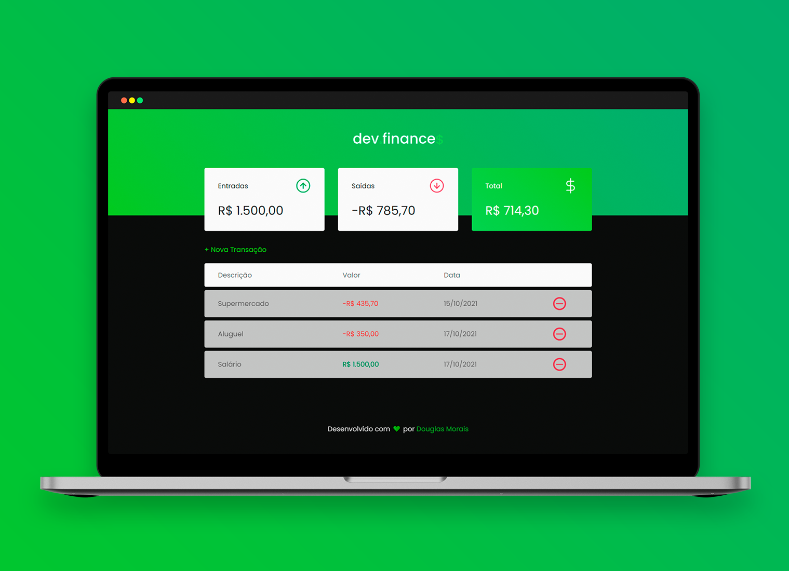

&NewLine;

  

Created to optimize your financial control. 💸

<h4 align="center"> 
	🚧  Projeto em melhoria . . .  🚧
</h4>

 <a href="#-sobre-o-projeto">Sobre</a> •
 <a href="#-layout">Layout</a> • 
 <a href="#-funcionalidades">Funcionalidades</a> •
 <a href="#-tecnologias">Tecnologias</a> • 
 <a href="#-autor">Autor</a> • 
 <a href="#-licença">Licença</a>

## 💻 Sobre o projeto

💸 DevFinances - é uma ferramenta criada para controlar os seus gastos, receitas e o balanço geral do seu dinheiro de maneira bem simples e clara.

Projeto desenvolvido durante a primeira edição da maratona **DISCOVER** oferecida pela [Rocketseat](https://app.rocketseat.com.br/discover).
O Discover é um treinamento inicial online com conteúdos básicos de desenvolvimento, mas com conhecimentos essenciais para um bom programador.

## 🎨 Layout

    

## ⚙ Funcionalidades

- [x] Adicionar nova entrada/saída 
- [x] Remover item do histórico
- [ ] Modificar item cadastrado
- [ ] Criar conexão com banco de dados
- [ ] Criar cadastro de usuário
- [ ] Autenticação do usuário

## 🚀 Tecnologias

As seguintes ferramentas foram usadas na construção do projeto:

- **[JavaScript](https://javascript.info/js)**
- **[HTML](https://www.w3schools.com/html/html_intro.asp)**
- **[CSS](https://www.w3schools.com/css/css_intro.asp)**

## 🦸 Autor

## 📝 Licença

Este projeto esta sobe a licença [MIT](./LICENSE).

Feito com 💚 por <a href="https://www.linkedin.com/in/douglasmorais">Douglas Morais</a>.
 
